>译:[CSS3-TRANSFORM](http://www.w3.org/TR/css3-transforms/#perspective-property)

重点部分译注并未全部。有一些自己的理解，如有不当请指正。:-D

变换渲染模型
-----------------
为transform属性指定一个除了none的值便会在元素上创建一个新的局部坐标系统并且应用于这个元素。通过元素的变换模型，元素可以绘制渲染出自己的坐标系统。变换是可以积累的。也就是说，元素可以通过父元素的坐标的系统来建立自己的局部坐标系统。从用户的视角看，一个元素不但可以从它的祖先元素上有效的积累`transform`属性，而且也可以给自己增加`transform`属性并应用与自己。这些变换的积累为元素描绘出了当前的变换模型。

带有两个轴的坐标空间：X轴水平向右为正，Y轴垂直向下为正。立体的变换函数增加了坐标空间将其延生至了三维空间，增加的Z轴垂直与屏幕，并且面向观察者的方向为正(也就是电脑屏幕前的我们)。如图。
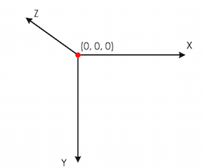

变换模型通过如下的`transform`和`transform-origin`属性进行计算
1. 从具体的模型开始
2. 通过`transfrom-origin`的X,Y,Z计算值进行移动
3. 从左到右复合应用在`transform`属性中的transform functions
4. 使之前设置的`transform-origin`的值无效并进行移动

**EXAMPLE1**
```
div {
  transform: translate(100px,100px);
}
```
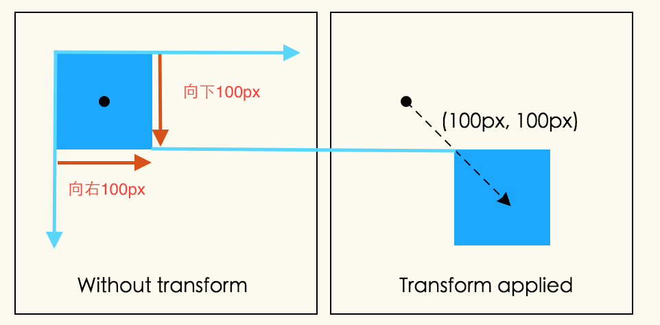
**EXAMPLE2**
```
div {
  height: 100px;
  width: 100px;
  transform-origin: 50px 50px;
  transform:rotate(45deg)
}
```
`transform-origin`通过在X,Y轴方向上各移动50px来移动原点。元素沿着原点顺时针旋转了45°。当所有的transform functions都应用后，平移后的原点在X,Y轴上又各移动了-50px,回到了原来的位置。如图
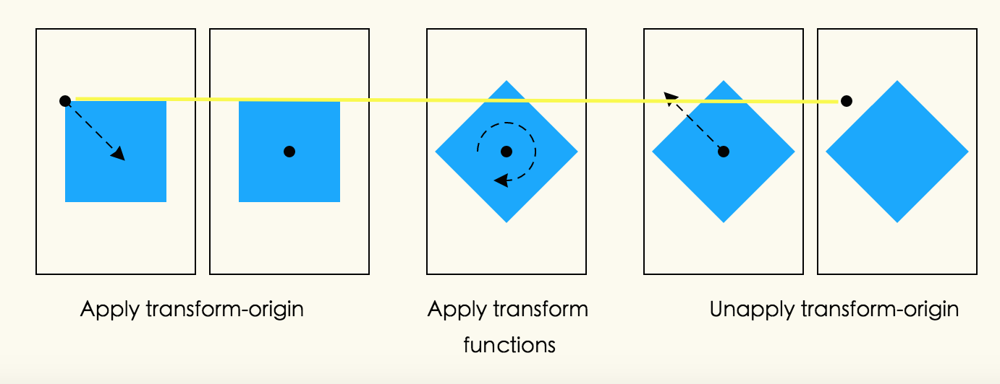
**理解**
上面的话的意思就是，`transform-origin`的起始点是在原点的位置，旋转围绕着`transform-origin`在转，移动`transform-origin`是从原点开始的，而不是`transform-origin`的默认位置开始移动的(默认为元素中心，上例恰好也刚刚好移动到元素的中心位置)，`transform-origin`移动完后，并在元素上已经将`transform functions`应用完后，平移后的原点便会回到原来的位置，也就是说，下次改变`transform-origin`的位置仍然是从起始点算起（也就是之前的原点）。

**EXAMPLE3**
以下所涉图片深绿色部分均是没有使用变换属性时元素的本来样子。
```
div {
  height: 100px;
  width: 100px;
  transform: translate(80px,80px) scale(1.5,1.5) rotate(45deg);
}
```
首先在X,Y轴上各移动80px,然后将元素放大150%，接着沿着Z轴方向顺时针旋转45°。
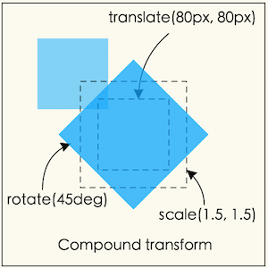
`注意`:缩放和旋转，都是通过元素的中心进行运转的，因为元素的默认`transfrom-origin`值为50% 50%。
>通过嵌套元素可以实现与上面相同的效果
```
<div style="transform: translate(80px, 80px)">
  <div style="transform: scale(1.5, 1.5)">
      <div style="transform: rotate(45deg)"></div>
  </div>
</div>
```

3D变换渲染
------------
通常，元素都是依照平面进行渲染，并且被渲染的元素与它们的包含块的平面一致。平面的transform functions可以改变元素的表现，但是它仍然在与它的包含块相同的平面里进行渲染。

三维的变换会导致变换模型有着一个非0的Z组件(Z轴投射在屏幕的外面)。这样可以造成元素可以在不同的平面进行渲染，而不是在它的包含块的平面内进行渲染。这也可能会影响一个元素和与之有联系的另一个元素从前到后的渲染顺序，同时和导致与其他元素发生交叉。这样的表现依赖于这个元素是否为3D rendering context中的一员，正如下所说
>上面的描述并不会完全准确的在WebKit中是实现。也许它会被改变来适应现在的是实现？See,[Bug 19637](https://www.w3.org/Bugs/Public/show_bug.cgi?id=19637)

**EXAMPLE4**
```
div {
  height: 150px;
  width: 150px;
}
.container {
  border: 1px solid black;
  background-color: #ccc;
}
.transformed {
  transform: rotateY(50deg);
  background-color: blue;
}
```

```
<div class="container">
  <div class="transformed"></div>
</div>
```
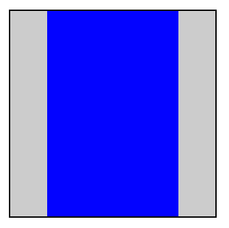
这次变换是一个围绕着垂直的Y轴进行的50度旋转。但是为什么这次变换为什么使的盒子便窄了呢？而不是变得立体呢？

`perspective`和`perspective-origin`属性可以通过使元素在Z轴变得更高而使元素显得更大，以此来增加观者在空间深度上的感知，同时也可以通过同样的方法使之显得越小。缩放比例的比例项公式是`d/(d-Z)`,`perspective`的值就是从绘制平面到假设的观者眼睛的位置。
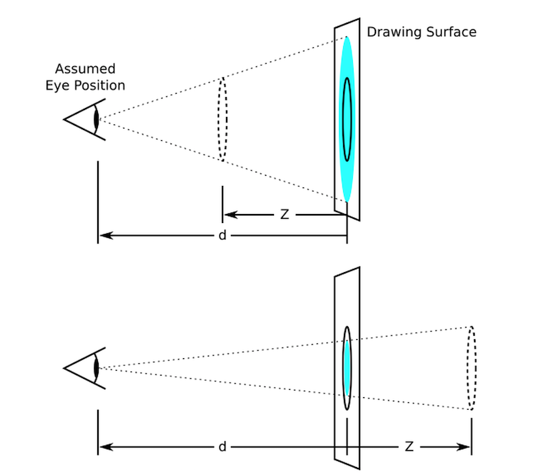
上图用图形解释了缩放比例是如何依赖于`perspective`属性和Z的值。在上面的那张图，Z值是d的一半。原始的圆圈(实线圆圈)出现在Z上(虚线圈)，为了是它呈现在画面中，圆圈通过以上两个要素按比例放大，最后在画面中呈现出来了放大的浅蓝色圆圈。下面的图形，圆圈通过比例进行缩小出现在原始位置后面的1/3圆圈，最后在画面中呈现出了缩小的浅蓝色圆圈。

通常假设观察者眼睛的位置在画面的中央。但是，如果想的话，这个位置也是可以移动的-例如，如果一个网页包含了很多图画那么大家通过设置`perspective-origin`的值来分享相同的视角。
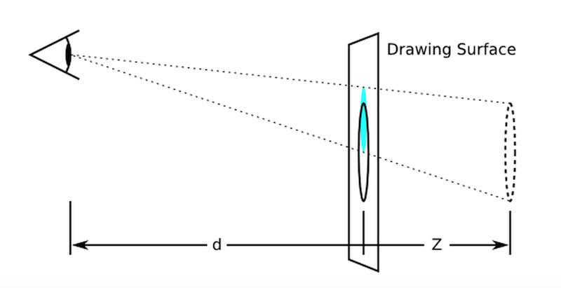
图形表现了向上移动perspective origin对表现效果的影响

透视模型按如下进行计算：
1. 从具体的模型开始
2. 通过 设置的`perspective-origin`的X,Y的计算值进行移动
3. 通过获得`perspective`属性的值应用在模型上
4. 使之前设置的`perspective- origin`的值无效并进行移动
**EXAMPLE5**
这个例子表现了透视可以被用来表达立体的变换从而显现出更多真实的细节
```
div {
  height: 150px;
  width: 150px;
}
.container {
  perspective: 500px;
  border: 1px solid black;
  background-color: #ccc;
}
.transformed {
  transform: rotateY(50deg);
  background-color: blue;
}
```

```
<div class="container">
  <div class="transformed"></div>
</div>
```
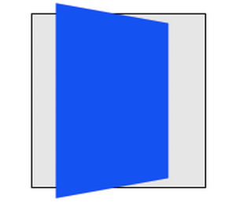
>里面的元素和在前面的例子中有着相同的变换，但是它的渲染被父元素上的`perspective`属性所影响。透视给予了一个显现的深度，导致顶点有了Z坐标(靠近观察者)使其在X,Y轴被放大，并且更进一步的(在负的Z轴上)也会被缩小。

一个并不包含在3D渲染上下文中的立体变换元素有着合适的transform值进行渲染，但是也不会与其他任何元素发生相交。在这个EXAMPLE4中的立体变换可以被考虑为一种绘画效果，就像平面中的变换。相似的，变换不会影响渲染命令。举个例子，在transform中设置Z的值使元素进行移动可能使元素变得更大，但是并不会导致元素去渲染它前面没有设置Z值的元素

一个包含在3D渲染上下文的立体变换元素在同样的3D渲染上下文中可以与其他元素相交;参与相同3D渲染上下文的元素，根据它们的变换结果，可能会互相隐藏或者相交。在同样的3D坐标空间摆放，使它们好像全部都是兄弟姐妹。一个元素在立体空间中摆放的位置决定于从建立3D渲染上下文的包含块中积累的变换模型所决定。
**EXAMPLE6**
```
div {
  height: 150px;
  width: 150px;
}
.container {
  perspective: 500px;
  border: 1px solid black;
  background: #ccc;
}
.transformed {
  transform: rotateY(50deg);
  background-color: blue;
}
.child {
  transform-origin: top left;
  transform: rotateX(40deg);
  background-color: lime;
}
```

```
<div class="container">
  <div class="transformed">
    <div class="child"></div>
  </div>
</div>
```
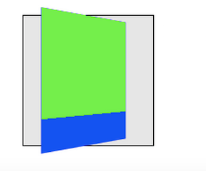
>这个例子表现了嵌套的3D变换元素在缺少`transform-style: preserve-3d`时是如何渲染的。蓝色的div和之前的例子变换结果是一样的，都是被父元素的`perspective`属性所影响。绿黄色的元素同样有绕着X轴进行旋转的3D变换。然而，绿黄色元素在它的父元素所在平面进行渲染因为他不是3D渲染上下文中的一员；父元素是二维的。

按照如下规则，元素可建立并参与在3D渲染上下文中:

+ 3D渲染上下文通过有着`transform-style: preserved-3d`值的变换元素创建并且它自己并不是3D渲染上下文中的一员。这样的元素通常都是一个包含块。一个元素建立3D渲染上下文同样也参与其中。
+ 一个有着`transform-style: preserved-3d`值的元素，参与在它自己创建的3D渲染上下文中，扩大了3D渲染上下文，而不是建立了一个新的3D渲染上下文。
+ 一个元素参与3D渲染上下文，除非它的包含块建立了3D渲染上下文或者扩展了3D渲染上下文

最后的变换结果通常是在3D渲染上下文中渲染的元素3D变换模型的积累，如下：
1. 从具体的模型开始
2. 对于每一个在3D变换根元素和元素之间的包含块，考虑以下几点：

+ 在元素的包含块上积累perspective matrix(如果可以的话)。包含块并不一定要成为3D渲染上下文中的一员
+ 元素的offset-parent是相对于它的包含块的，元素应用计算后的移动值等同于垂直水平移动。
+ 累加变换效果

**EXAMPLE7**
```
div {
  height: 150px;
  width: 150px;
}
.container {
  perspective: 500px;
  border: 1px solid black;
  background: #ccc;
}
.transformed {
  transform-style: preserve-3d;
  transform: rotateY(50deg);
  background: blue;
}
.child {
  transfom-origin: top left;
  transform: rotateX(40deg);
  background-color: lime;
}
```
>这个例子和前面的例子是相同的，除了加了一个`transform-style: preserve-3d`值在蓝色的元素上。蓝色的元素建立的3D渲染上下文，绿黄色元素是其中一员。现在蓝色和绿黄色元素都被容器中的perspective所影响，并且同时分享了一个相同的立体空间，所以浅绿色的元素在它的父元素上摆动。
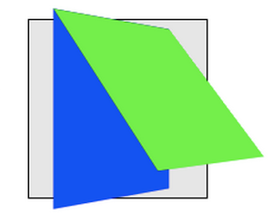

元素在同样的3D渲染上下文中可能会彼此相交。

在3D渲染上下文中不变换的元素在Z=0的平面上也有可能与变换元素相交。

在3D渲染上下文里，在应用完积累的变换后，没有相交的元素的渲染顺序基于在Z轴上的位置。元素在Z轴的位置相同则渲染顺序由层叠上下文决定。
**EXAMPLE8**

 ```
 div {
  width: 150px;
 }
 .container {
  height: 145px;
  background-color: rgba(0,0,0,0.3);
  border: 1px solid black;
  transform-style: preseve-3d;
  perspective: 500px;
 }
 .container>div {
  position: absolute;
  left: 0;
 }
 .container> :first-child {
  transform: rotateY(45deg);
  background-color: orange;
  top: 10px;
  height: 135px;
 }
 .container> :last-child {
  transform: translateZ(40px);
  background-color: rgba(0,0,255,0.75);
  top: 50px;
  height: 100px;
 }
 ```

 ```
 <div class="container">
   <div></div>
   <div></div>
 </div>
 ```
>这个例子展示了，在3D渲染上下文中元素是可以相交的。容器元素为自己创建了3D渲染上下文并且他有两个子元素。子元素互相相交，同时橘黄色的元素也与容器相交。
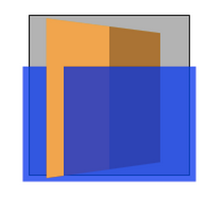

使用立体变换，让一个元素的背面朝着观者是完全有可能的。3D变换元素在两面展示相同的内容，所以反面看起来就像镜子中的正面(就像元素映射在一片镜子上一样)。通常，元素的反面朝着观者都会隐藏。然而，`backface-visiblity:hidden`属性允许作者时时其不可见当元素的反面朝着观者时。如果一个带有`backface-visiblity:hidden`属性的元素是有效的，那么他的前面和背面便会交替的隐藏，然后，只有当前面朝向观者时元素才是可见的。

**理解backface-visibility属性**
```
.wrap {
  width: 200px;
  height: 200px;
  border: 1px solid black;
  perspective: 200px;
  color: #fff;
  text-align: center;
  font-size: 50px;
}
.inner {
  width: 50px;
  height: 50px;
  margin: 20px auto;
  background: orange;
  line-height: 50px;
  transform: rotateY(180deg);//旋转180
}
```

```
<div class="wrap">
  <div class="inner">2</div>
</div>
```
图左为旋转前，图右为旋转后。

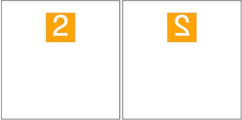
可以看出图右就像平时我们照镜子在镜子中的投影一样。这个就是元素的背面。
接下来当我们在元素上加`backface-visibility:hidden`属性则元素便会被隐藏，看起来消失了一样。如图

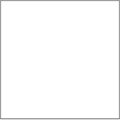 


