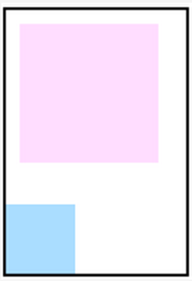
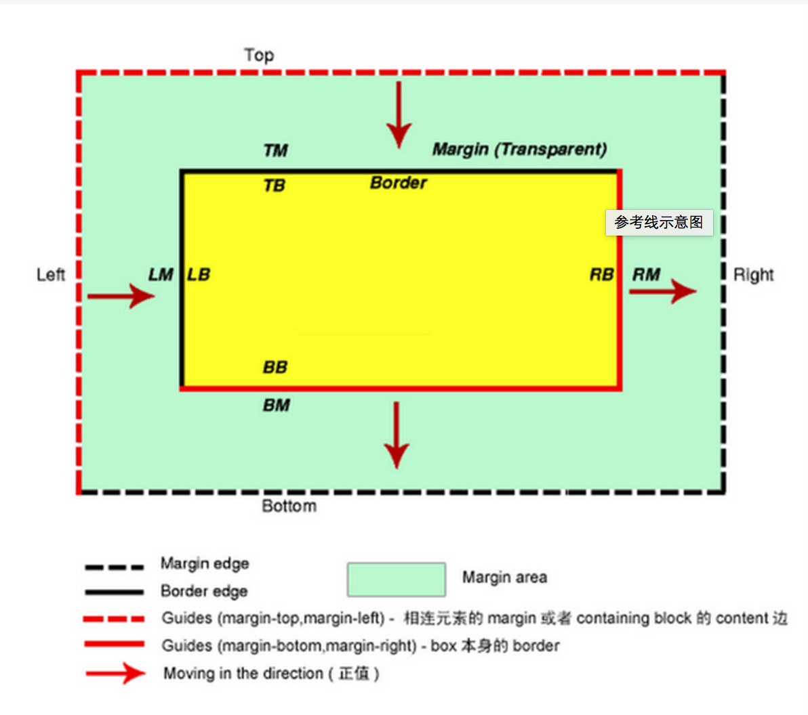
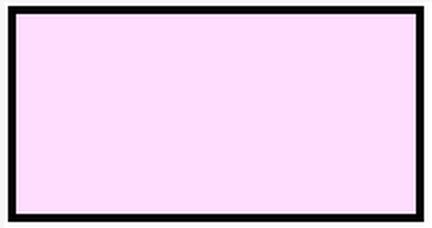
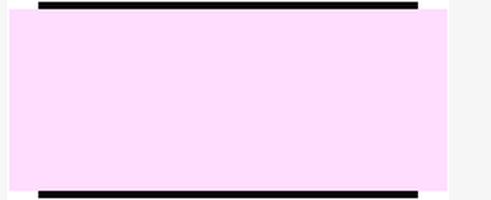
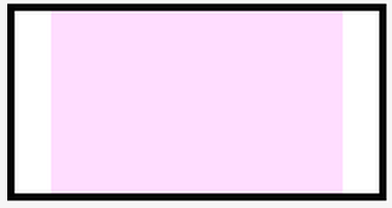
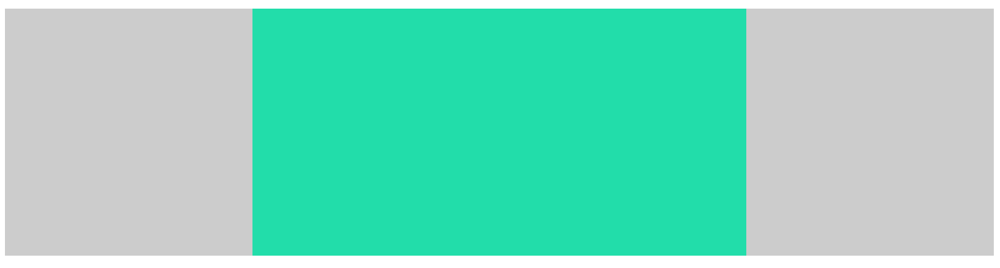
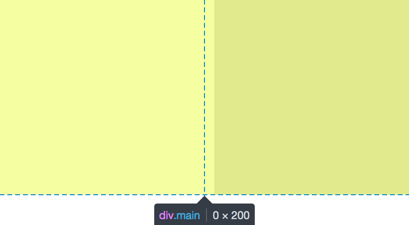
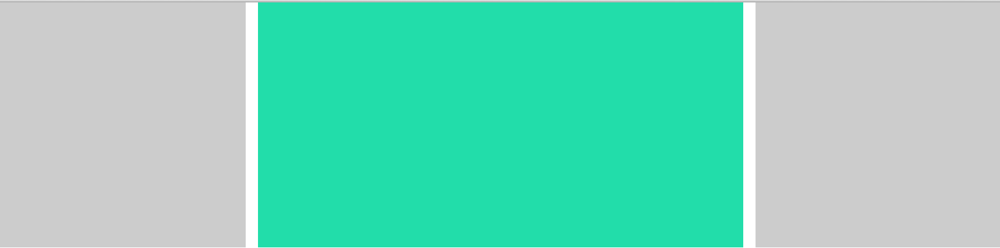
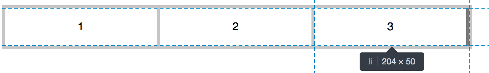

Margin与宽高度的关系
=====================
博客同步地址[Margin与布局](http://segmentfault.com/a/1190000003999937)
在讲此之前，必须知道什么是containing-box以及一些宽高度的一些关系，关于containing-box的概念以及与宽高度的关系可看我的前一篇文章[CSS:关于元素高度与宽度的讨论 系列文章(三)][1]。

1.元素containing-box宽高度等于内容宽度(原理1)
-----------------------------------------
HTML

    <div class="wrap">
        <div class="item1"></div>
        <div class="item2"></div>
    </div> 

CSS 

     .wrap {
        float: left;
        border: 2px solid #000;
      }
     .item1 {
        width: 100px;
        height: 100px;
        background: #fdf;
        margin-left: 10px;
        margin-top: 10px;
        margin-right: 20px;
        margin-bottom: 30px;
     }
    .item2 {
        width: 50px;
        height: 50px;
        background: #adf;
     }


能满足原理2的条件只有一种，元素不设宽度且在文档流中，此时，父元素wrap产生的containing-box的宽高宽度等子元素border-box的宽高度加上外边距的宽高度，也就是说，子元素的margin值也是其containing-box的一部分。margin一共有两类参考线，第一类是margin-top与margin-left的参考线,第二类是margin-bottom与margin-right的参考线,**`第一类margin`的参考线**是以其所处的**containing-box的边缘线**为参考线,如上例所示,当调整元素.item1的margin-top与margin-left的值时,元素.item1所处的containing-box的大小也在发生变化因此其边缘线也在不断变化同时也就导致.item1元素自身的位置也在发生变化,看起来就是.item1自身发生了移动。`第二类margin`的参考线是以元素自身的边缘线(外边距的外侧为边缘线)为参考线,同样的,调整上例中的margin-bottom值,.item1的margin-bottom也在不断的发生变化,也就是说其自身边缘线在不断的移动,同时导致了.item2的移动。根据上面的论述,我们可以得出结论,**外边距的调整也就等于让其自身相对的参考线的位置在发生移动**,同时导致相对于参考线运动的元素发生移动。元素自身相对于containing-box的边缘线移动而移动,与元素自身为兄弟关系的元素相对于元素自身的边缘线移动而移动。参考线示意图如图所示,按箭头所指方向使参考线变化的margin值都为正值。
综上，我们可以利用margin对元素自身进行移动,同时也可让其相邻元素进行移动,移动的同时我们需要知道的是其所处的containing-box的大小也在发生变化。

综上，当元素宽高度等于内容宽高度时，可通过调整内容的margin值来调整其containing-box的大小，因为containing-box的变化也就会导致元素本身的移动，也就是说既可以移动元素，也可调整元素与元素之间的间距。

2.元素border-box宽度+margin等于其containing-box的宽度(原理2)
----------------------------
    <div class="wrap">
       <div class="wrap-inner"></div>
    </div>

    .wrap {
        width: 100px;
        border: 2px solid #000;
        margin: 0 auto;
    }
    .wrap-inner {
        height: 50px;
        background: #fdf;
    }

上例中,元素wrap-inner的border-box宽度加上margin的大小等于其containing-box的宽度,因此当containing-box宽度固定,根据公式`'margin-left' + 'border-left-width' + 'padding-left' + 'width' + 'padding-right' + 'border-right-width' + 'margin-right' = width of containing block`,调整其自身margin-left或margin-right值,便会使wrap-inner自身大小发生变化,margin-left为正值且值逐渐变大,则wrap-inner自身宽度逐渐变小,若margin-left为负值且逐渐变小,则wrap-inner自身宽度逐渐变大,margin-right同理。一定要注意这里的宽度继承和`width:100%`是有本质区别的，因为`width:100%`就等于它的containing-box的100%和它的margin，border或者padding都木有关系，具体可看我的关于宽度与高度讨论的系列文章三里的例子，罗嗦了一点，但是这里是容易犯错误的地方，把这两种继承的情况以外是一样。一定要注意！！！。

 - 将margin-left和right调整为-10px,如图,根据计算,wrap-inner变宽

 - 将margin-left和right调整为10px,如图,根据计算,wrap-inner变窄


综上，当元素宽或高度等于其containing-box的宽度或高度时,且containing-box的宽度固定我们便可以利用margin对其进行自身宽度大小的调整。也就是说宽高度和containing-box有关系时，我们利用margin可进行内里元素大小的调整。 

利用Margin进行布局
====================
通常在布局中我们会遇到那些问题呢？下面是我自己实践中遇到的一些问题
###问题1
当我们拿到一份设计稿，然后这份设计稿有像下面这样的布局，整体居中，里面元素排一排，当然布局的方式会有很多种，那么如果我们采用浮动布局或者`display:inline-block`进行布局会出现什么问题呢，如图我们可以看出，若采用上述两种方式进行布局，那么每个块的宽度加上间隙，就会超出包含块的宽度，当然我们也可以将包含块的宽度进行增大以留下足够的位置供元素摆放，但是这种方法明显是不可取的，那么如何解决这个位置不够的问题呢，可以看下面的栗子1 。


**栗子**
html
```
<div class="container">
  <div class="inner-wrap">
      <div class="inner"></div>
      <div class="inner"></div>
      <div class="inner"></div>
  </div>
</div>
```

css
```
body {
  margin: 0;
}
.container {
  margin: 0 auto;
  width: 980px;
}
.inner-wrap {
  margin-left: -10px;
}
.inner {
  float: left;
  margin-left: 10px;
  width: 320px;
  height: 200px;
  background: #2df;
}
```
此布局便利用了原理2，利用负margin增加了inner-wrap的宽度，但不改变整体的宽的情况下，实现效果。如下


###问题2
上面的例子仅仅只是实现了三列固定宽度的布局，这样的布局当屏幕宽度发生变化的时候便会出现问题。因此我们便会有如下需求。
#####左右列固定，中间列自适应
**栗子**
html
```
<div class="main">
  <div class="main-content"></div>
</div>
<div class="left"></div>
<div class="right"></div>
```
css
```
.main {
  float: left;
  width: 100%;
}

.main-content {
  height: 200px;
  background: #2da;
  margin: 0 200px;
}

.left,.right {
  float: left;
  width: 200px;
  height: 200px;
  background: #ccc;
}

.left {
  margin-left: -100%;
}

.right {
  margin-left: -200px;
}
```
效果如下,当你缩小屏幕时，中间部分会随着屏幕的缩小而缩小，另外两部分宽度不变，同样也满足了主要内容优先加载的需求，可谓一举两得

######分析
可以看出上面的布局利用了原理2，但是这里仍然会有几个为什么要问。

+ 首先，为什么main里面一定要嵌套main-content,为什么不能直接使用单个main(假设1)？
+ 其次，为什么main上一定要设置`float:left`，可以设置其他值吗，如position:absolute(假设2)？

分析上面的布局之前，我们也要了解到上面的布局满足了我们的什么需求，这里有两点1.主要内容优先加载。2.主要内容自适应。这里我们可以分析一下，我们是怎样达到上述两个目的的。首先，要达到目的1，我们就的把`div.main`放在前面来写，因为浏览器是从下到下渲染页面的，放在前面的也就会先渲染。且由于`div.main`为文档流中的块级元素，因此会独占一行，因此我们需要使其脱离文档流，这样才能使下面的元素能有机会上的来(这里之所以不考虑`display:inline-block`是因为div.main的长度会独占一行，就算设置`display:inline-block`也没有任何作用，下面的元素仍然上不来)。而要达到目的2，需要用到原理2。同时在上面提出的两个问题中，有两个假设。

**假设1**，如果使用单个main可不可以满足上述两个需求？我们可以试试。
html
```
<div class="main"></div>
<div class="left"></div>
<div class="right"></div>
```
css
```
body {
  margin:0;
}
/*这里注意需要改掉main的流方式，下面的元素才上的来*/
.main {
  float:left
  margin: 0 210px;
  height: 200px;
  background:#2da;
}
.left,.right {
  float: left;
  width: 200px;
  height: 200px;
  background: #ccc;
}
.left {
  margin-left: -100%;
}
.right {
  margin-left: -200px;
}
```
效果如下，
从中线分开的黄色两部分为各自为main的左右外边距

从结果中，我们可以看出使用单个main是不行的，因为在不设宽度且元素不在文档流中时，元素的宽度为0，不能满足我们的需求，正因为我们同时要满足1.main元素不在文档流中2.元素不设宽度且在文档流中。这两个条件当然是不能同时在一个main元素下能达到的，因此我们需要再嵌套一个main-content让它来满足条件2。这也就解释了为什么一定要嵌套一个main-content。
解决了问题1，现在我们来说问题2。

**假设2**,main上的float值可以换为position:absolute吗？
同样的，我们试试
html
```
<div class="main">
  <div class="main-content"></div>
</div>
<div class="left"></div>
<div class="right"></div>
```
css
```
body {
  margin: 0;
}
.main {
  position:absolute;
  width:100%;
}
.main-content {
  margin: 0 210px;
  height: 200px;
  background: #2da;
}
.left,.right {
  width: 200px;
  height: 200px;
  background:#ccc;
}
.left {
  float: left;
}
.right {
  float: right;
}
```
答案是可以的，只是我们需要改掉一些值，而当main为float之所以要给`div.left`与`div.right`要设置margin-left值是因为浮动元素浮动时，当它的外边缘碰到包含框或者另一个浮动框的边框为止。而为浮动元素的`div.main`占据了整整一行，因此下面的浮动元素`div.left`与`div.right`便被挤了下来，而设置它们的margin-left值便可以把它们移上去，这里便运用了原理1。而当我们把`div.main`的float值改为position:absolute时，便不会存在被挤下来的问题，可直接设置`div.left`与`div.right`的float的值。效果如下。

如若只需要达到宽度自适应的要求，那么，这时候便可以将`div.main`放在最后面且不用嵌套`div.main-content`,具体如何实现，大家可以自己试试。
两列布局的道理也是差不多的，这里我就不写了，大家可以看这篇文章
[margin系列之布局篇](http://blog.doyoe.com/2013/12/31/css/margin%E7%B3%BB%E5%88%97%E4%B9%8B%E5%B8%83%E5%B1%80%E7%AF%87/)

###问题3
如下所示设计稿，在我们进行布局的过程中，可能会出现border重合的情况，因为一方面我们需要对整个整体加上border，而另一方面我们又需要利用border隔开那三个小块。那么如果我们对每个小块都加上右边框，可以想象，最右边就会出现边框的堆叠而这不是我们希望看到的，所以，要如何解决这个问题，可以看如下例子给出的答案。

**栗子**
html
```
<ul>
  <li>1</li>
  <li>2</li>
  <li>3</li>
</ul>
```
css
```
ul {
  position:absolute;
  margin: 0;
  padding:0;
  list-style:none;
  border: 4px solid #c5c5c5;
}
li {
  float:left;
  width: 200px;
  height: 50px;
  line-height: 50px;
  text-align: center;
  border-right: 4px solid #c5c5c5;
}
```
没在li上加`margin-right:-4px;`前,效果如图,发生了堆叠。

加了`margin-right: -4px`后，达到预期效果。因为加上了`ul`的右边框发生了移动与第三个`li`的右边框进行了重叠。因此效果上来看便符合了预期,如图

此布局便利用了原理1，通过元素对相邻元素位置的控制来达到预期的效果。
而利用原理1也可以实现元素居中的布局，先让元素上左各移50%，然后再让设置元素的上左margin值设置为元素自身宽度的一半长度，以对元素本身进行移动。便可达到元素居中放置的目的。


[1]: http://segmentfault.com/a/1190000003771391
