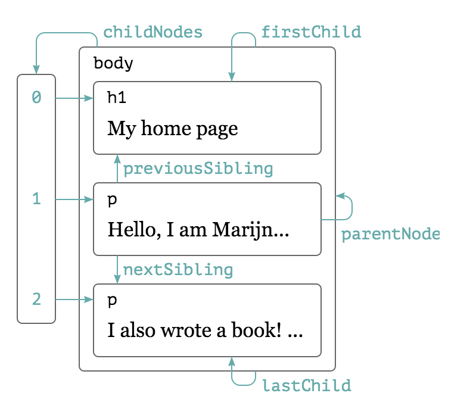

**Note:**IE中的所有DOM对象都是以COM对象的形式实现的。这意味着IE中的DOM对象与原生Javascript对象的行为或活动特点并不一致。

**DOM1级主要定义了HTML和XML的文档的底层结构。DOM2和DOM3级分为几个模块。**

+ DOM2级核心(DOM Level 2 Core):在1级核心基础上构建，为节点添加了更多方法和属性
+ DOM2级视图(DOM Level 2 Views):为文档定义了基于样式信息的不同视图
+ DOM2级事件(DOM Level 2 Events):说明了如何使用事件与DOM文档交互
+ DOM2级样式(DOM Level 2 Style):定义了如何以编程方式来访问和改变CSS样式信息
+ DOM2级遍历和范围(DOM Level 2 Tranversal and Range):引入了遍历DOM文档和选择其特定部分的新接口。
+ DOM2级HTML(DOM Level 2 HTML):在1级HTML基础上构建，添加了更多属性、方法和新街口。

```
// 判断是否支持模块
var DOM2Core = document.implementation.hasFeature('Core',2.0)
```

DOM2级核心
================

Node
---------
>DOM1级定义了一个Node接口。该接口将由DOM中的所有节点类型实现。
Javascript中的所有节点类型都 **继承**自Node类型，因此所有节点类型都共享着相同的基本属性和方法。

**兼容性:**除IE外，其他所有浏览器都可以访问到这个类型

###节点类型
>每个节点都有一个`nodeType`属性，用于表明节点的类型。
节点类型由在Node类型中定义的12个数值常量来表示，下面列出常用的几个。

+ Node.ELEMENT_NODE: 1
+ Node.TEXT_NODE: 3
+ Node.COMMENT_NODE: 8

####节点信息
>可以通过`nodeName`和`nodeValue`来了解节点信息。这两个属性取决于节点的类型。
在使用这两个节点之前，最好先检测一下节点类型。

如果节点是一个元素，nodeName中保存的始终是元素的标签名，而nodeValue值始终为0。

####节点关系
>每个节点都有一个`childNodes`属性，其中保存着一个NodeList对象。NodeList对象是一种类数组对象，用于保存一组有序的节点，可以通过位置来访问这些节点。


`hasChildNodes()`:这个方法在节点包含一个或多个子节点的情况下返回true。
`ownerDocument`:该属性指向表示整个文档的文档节点。

```
// 将NodeList对象转换为数组
var arrayOfNodes = Array.prototype.slice.call(someNode.childNodes,0);
```
**兼容性:**IE8以及更早版本将NodeList实现为一个COM对象，因此上面的代码会导致错误。

**Note:**NdoeList对象的特殊之处在于，它实际上是基于DOM结构动态执行查询的结果，因此DOM的变化能直接反映在NodeList对象之中。它是有生命的对象，而不是在我们第一次访问它在某一个瞬间拍下的快照。

####操作节点

+ `appendChild()`:用于向childNodes列表的末尾添加一个节点。返回新增的节点。
+ `insertBefore()`:接收两个参数:要插入的节点和作为参照的节点。插入节点后，被插入的节点会变成参照节点的前一个同胞节点。同时被方法返回。
+ `replaceChild()`:接收两个参数:要插入的节点和要替换的节点。要替换的节点将由这个方法返回并从文档树中移除。同时由要插入的节点占据其位置。
+ `removeChild()`:接收一个参数，即要移除的节点。返回被移除的节点。

这四个方法都是操作的某个节点的子节点，也就是说，要使用这几个方法必须先取得父节点。另外并不是所有节点都有子节点，如果在不支持子节点的节点上，调用了这些方法，将会导致错误。

**Note**:
1. 如果传入到`appendChild()`中的节点已经是文档的一部分，那结果就是将该节点从原来的位置转移到新位置。即使可以将DOM树看成是由一系列指针连接起来的，但任何DOM节点也不能同时出现在文档中的多个位置上。
2. 在使用`replaceChild()`插入一个节点时，该节点的关系指针都会从被它替换的节点复制过来。从技术上来讲，被替换的节点仍然还在文档中，但它在文档中已经没有了自己的位置。同样的，`removeChild()`移除的节点也同样为文档所有，只不过在文档中已经没有了自己的位置。

####其他方法
>有两个方法是所有类型节点都要的。

1. `cloneNode()`:用于创建调用这个方法的节点的一个完全相同的副本。接收一个布尔值参数，true:表示执行深复制，也就是复制节点以及整个子节点树。false:表示执行浅复制，即只复制节点本身。

```
<ul>
  <li>item 1</li>
  <li>item 2</li>
  <li>item 3</li>
</ul>

var myList = document.body.childNodes[1];
var deepList = myList.cloneNode(true); //3 (IE < 9)或7(其他浏览器)
console.log(deepList.childNodes.length);

// 使用childNodes属性的建议
for (var i =0; i < ele.childNodes.length; i++){
    if(childNodes[i].nodeType === 1) {
        // 执行某些操作
    }
}
```

**Note**:
+ `deepList.childNodes.length`中的差异主要是因为IE8以及更早版本与其他浏览器处理空白字符的方式不一样。IE9以及之前版本不会为空白符创建节点。
+ `cloneNode()`方法不会复制添加到DOM节点中的Javascript属性，例如事件处理程序等。这个方法只复制特性，在明确指定的情况下也复制子节点，其他一切都不会复制。IE在此存在一个bug，即它会复制事件处理程序，所以建议，在复制之前最好先移除事件处理程序。

2. `normalize()`:处理文档树种的文本节点。


Document类型--nodeType=9
------------------------------
>Javascript通过Document类型表示文档。HTMLDocument继承自Document类型
1.document对象是HTMLDocument对象的实例
2.document对象是window对象的一个属性，可以将其作为全局对象进行访问。

```
document instanceof HTMLDocument //true
HTMLDocument.__proto__ ==== Document //true
```

document作为我们操作文档的一个公共接口存在。

###document信息

+ `document.URL`:包含页面完整的URL
+ `document.domain`:包含页面的域名
+ `document.referrer`:保存着链接到当前页面的那个页面的URL
在这三个属性中只有domain是可以设置的。但由于安全方面的限制，也并非可以给domain设置任何值。
1. 不能将这个属性设置为URL中不包含的域
2. 如果域名一开始是松散的，那么不能将它设置为紧绷的。

```
// 假设页面来自p2p.wrox.com域
document.domain = 'wrox.com'; // 松散的,成功
document.domain = 'nczonline.ne4t' // 出错
document.domain = 'p2p.wrox.com'   // 紧绷的,出错
```

+ `document.readyState`:有两个可能的值(HTML5新增)
  1. loading:正在加载文档
  2. complete:已经加载完文档
+ `document.compatMode`:这个属性的作用是告诉开发人员浏览器采用了那些渲染模式(HTML5新增)
  1. 值等于'CSS1Compat',表明浏览器采用标准模式进行渲染
  2. 值等于'BackCompat',表明浏览器在混杂模式下进行渲染


###document子节点
+ document.documentElement:获得html元素的引用
+ document.body:获得body元素的引用
+ document.head:获得head元素的引用(HTML5新增)
+ document.title:包含title元素的中的文本
+ document.activeElement:这个属性始终会引用DOM中当前获得了焦点的元素(HTML5新增)

[Browser compatibility-head](https://developer.mozilla.org/en-US/docs/Web/API/Document/head)
[Browser compatibility-activeElement](https://developer.mozilla.org/en-US/docs/Web/API/Document/head)


###查找节点(元素节点)
>Document类型为查元素提供了两种方法，1,2
 HTMLDocument类型提供了方法，3

1. `document.getElementById()`
2. `document.getElementsByTagName()`:返回包含0或多个元素的NodeList。在HTML文档中，这个方法会返回一个 **HTMLCollection**对象，作为一个动态集合，该对象与NodeList非常相似。
3. `document.getElementsByName`:这个方法会返回带有给定name特性的元素，最常用于取得单选按钮。同样也返回 **HTMLCollection**对象。

`HTMLCollection`对象，可以通过length属性访问元素长度，通过[]方括号语法访问对象中的项。方括号中既可以是数字也可以是字符串的索引值。

###创建节点
`document.createElement()`:接收一个参数，即要创建元素的标签名。
`document.createTextNode()`:接收一个参数，要插入节点中的文本。

###特殊集合
>这些集合都是HTMLCollection对象

+ `document.anchors`:包含文档中带name特性的<a>元素
+ `document.forms`:包含文档中所有的<form>元素
+ `document.images`:包含文档中所有的元素
+ `document.links`:包含文档中所有带href特性的<a>元素


Element类型--nodeType=1
----------------------
>Element类型用于表现HTML或XML元素。HTMLElement类型继承自Element类型。并添加了一些属性。

`HTMLElement.__proto__ === Element`// true

###属性
#####读取
添加的属性:可读也可写
+ **id**
+ **title**
+ lang(很少使用)
+ dir(很少使用)
+ **className**:与元素的class特性对应。
+ `dataset`:HTML5规定可以为元素添加非标准的属性，但要添加前缀data-,目的是为元素提供与渲染无关的信息，或者提供语义信息。这些属性可以任意添加，随机命名，只要以data-开头即可。可以通过元素的`dataset`属性来访问自定义属性

```
    <div id="myDiv" class="bd" title="body text" lang="en" dir="ltr"></div>

    var div = document.getElementById('bd');
    console.log(div.id);
    console.log(div.className);
    console.log(div.title);
    console.log(div.lang);
    console.log(div.dir);
```

#####相关方法

+ `getAttribute()`:一般只有在取自定义特性情况下，才会使用此方法
+ `setAttribute()`:接收两个参数，要设置特性的特性名和值
+ `removeAttribute()`:用于彻底删除元素的特性 


#####attributes属性
>attributes属性中包含一个NamedNodeMap,与NodeList类似。
通常用于遍历元素的特性。

```
function outputAttributes ( ele ) {
    var pairs = [],
    attrName,
    attrValue,
    i,
    len;

    for(i = 0; i < ele.attributes.length; i++) {
        attrName = ele.attributes[i].nodeName;
        attrValue = ele.attributes[i].nodeValue;
        pairs.push(attrName + '=\' + attrValue + '\'')
    }
    pairs.join('');
}
```

###操作类名
>操作类名时，需要通过`className`属性添加、删除、和替换类名。因为`className`是一个字符串，所以即使只修改字符串一部分，也必须每次都设置整个字符串的值。

```
    <div class="bd user disabled"></div>

    // 删除'user'类

    // 首先取得类名字字符并拆分成数组
    var div = document.getElementsByTagName('div')[0];
    var className = div.className.split(/\s+/);

    // 找到要删的类名
    var pos = -1,
        i,
        len

    for(i = 0,len = className.length;i < len;i++) {
        if(className[i] === 'user') {
            pos = i;
            break;
        }
    }

    className.splice(i,1);

    // 把剩下的类名拼成字符串并重新设置
    div.className = className.join(' ');
```

为了从div中删除class属性中的'user',以上这些代码都是必须的。很多javascript都实现了这个方法，以简化这些操作
#####classList
>HTML5新增了一个操作类名的方式，可以让操作更简单也更安全。那就是为所有元素添加classList这个属性。这个classList属性是新集合类型DOMTokenList的实例。这个属性是只读的，有一个表示自己包含多少元素的length属性，而要取得每个元素可以使用item()方法，也可以使用方括号语法。如果你想修改classList属性，那么可以通过它定义的以下几个方法进行修改。

+ `add(value)`:将给定的字符串值添加到列表中。如果值已经存在，就不添加了
+ `remove(value)`:从列表中删除给定的字符串
+ `contain(value)`:表示列表中是否存在给定的值，如果存在则返回true,不存在返回false 
+ `toggle(value)`:如果列表中已经存在给定的值，删除它;如果列表中没有给定的值，添加它

[Browser Compatibility](https://developer.mozilla.org/en-US/docs/Web/API/Element/classList)

###插入标记(HTML5新增)
>insertAdjacentHTML():接收两个参数，插入位置和要插入的HTML文本

第一个参数必须是下列值之一:

+ beforebegin:在当前元素之前插入一个紧邻的同辈元素
+ afterbegin:在当前元素之下插入一个新的子元素或在第一个子元素之前再插入新的子元素
+ beforeend:在当前元素之下插入一个新的的子元素或在最后一个子元素之后插入新的子元素
+ afterend:在当前元素之后插入一个紧邻的同辈元素

[浏览器兼容性](https://developer.mozilla.org/zh-CN/docs/Web/API/Element/insertAdjacentHTML)

Text类型--nodeType=3
---------------------
>包含的是可以照字面意思接收的纯文本内容。

```
<!-- 没有内容，也就没有文本节点 -->
<div></div>

<!-- 有空格，因而有一个文本节点 -->
<div> </div>

<!-- 有内容，因而有一个文本节点 -->
<div>HELLO WORLD!</div>
```

###合并文本节点
>DOM文档中存在相邻的同胞文本节点很容易导致混乱，因为分不清哪个文本节点表示哪个字符串。
1. 浏览器在解析文档时，永远不会创建相邻的文本节点。
2. 出现相邻的文本节点只会作为执行DOM操作的结果出现

如果在一个包含两个或多个文本节点的父元素上调用，Node类型的`normalize()`方法，则会将所有文本节点合并成一个节点。

```
var ele = document.createElement('div');
var text1 = document.createTextNode('Hello World!');
var text2 = document.createTextNode('Hi');
ele.appendChild(text1);
ele.appendChild(text2);

document.body.appendChild(ele)

console.log(ele.childNodes.length);// 2
ele.normalize();
console.log(ele.childNodes.length);// 1
```

###分割文本节点
>splitText():这个方法会将一个文本节点分成两个文本节点，即按照指定的位置分割nodeValue值。

```
var ele = document.createElement('div');
var text = document.createTextNode('Hello World!');
ele.appendChild(text);

document.body.appendChild(ele)

var newNode = ele.firstChild.splitText(5);
console.log(newNode.nodeValue);// ' World'
```

操作表格
------------

```
// 创建table
var table = document.createElement('table');
table.border = 1;
table.width = '100%';

// 创建tbody
var tbody = document.createElement('tbody');
table.appendChild(tbody);

// 创建第一行
tbody.insertRow(0);
tbody.rows[0].insertCell(0);
tbody.rows[0].cells[0].appendChild(document.createTextNode('Cell 1.1'));
tbody.rows[0].insertCell(1);
tbody.rows[0].cells[1].appendChild(document.createTextNode('Cell 2.1'));

// 创建第二行
tbody.insertRow(1);
tbody.rows[1].insertCell(0);
tbody.rows[1].cells[0].appendChild(document.createTextNode('Cell 1.2'));
tbody.rows[1].insertCell(1);
tbody.rows[1].cells[1].appendChild(document.createTextNode('Cell 2.1'));

// 添加到文档中
document.body.appendChild(table);
```

选择符API
-----------
>可以通过Document类型和Element类型的实例调用他们。

1. `querySelector()`
2. `querySelectorAll()`

[Browser Compatibility-querSelector](https://developer.mozilla.org/en-US/docs/Web/API/Document/querySelector)
[Browser Compatibility-querSelectorAll](https://developer.mozilla.org/en-US/docs/Web/API/Document/querySelectorAll)

**Note**:
+ 不像如`getElementsByTagName`这样的API, 通过以上两个API返回的对象不是live的。也就是说当文档改变的时候，他们不会改变。
+ 具体来说，返回的值实际上是带有所有属性和方法的NodeList，而其底层实现则类似于一组元素的快照，而非不断对文档进行搜索的 **动态查询**。这样实现可以避免使用NodeList对象通常会引起的大多数性能问题

3. `getElementsByClassName()`:返回NodeList对象，所以使用这个方法与使用`getElementsByTagName()`以及其他返回NodeList的DOM方法具有同样的性能问题

[Browser Compatibility](https://developer.mozilla.org/en-US/docs/Web/API/Document/getElementsByClassName)

关于NodeList
-----------
>NodeList及其近亲NameNodeMap和HTMLCollection这个三个集合都是动态的。也就是说每当文档结构发生变化，他们都会得到更新。
本质上:NodeList对象是在访问DOM文档时实时运行的查询。

###性能影响
DOM操作往往是Javascript程序中开销最大的部分，而因访问NodeList导致的问题最大。一般来说，尽量减少访问NodeList的次数。因为每次访问NodeList，都会运行一次基于文档的查询。所以，可以考虑将从NodeList取得的值缓存起来。或者尽量减少DOM操作


DOM2级遍历和范围
==================

###元素遍历
>对于元素间的空格，IE9以及之前不会返回文本节点，而其他所有浏览器都会返回文本节点。这样就导致了在使用childNodes和firstChild等属性时的行为不一致。为了弥补这一差异。

**Element** Tranversal API为DOM元素添加了以下5个属性

+ `childElementCount`:返回子元素(不包括文本节点和注释)的个数
+ `firstElementChild`:指向第一个子元素;firstChild的元素版
+ `lastElementChild`:指向最后一个子元素;lastChild的元素版
+ `previousElementSibling`:指向前一个同辈元素;previousSibling的元素版
+ `nexrtElementSibling`:指向后一个同辈元素;nextSibling的元素版

[Browser Compatibility](https://developer.mozilla.org/en-US/docs/Web/API/ParentNode/firstElementChild)

