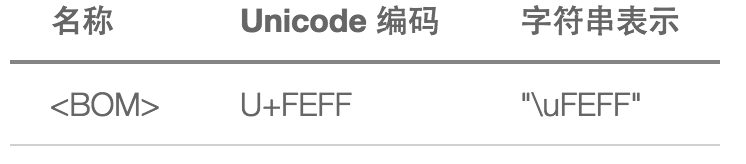

javascript数据类型及语言基础
-----------------------------

###cloneObject、isArray和isFuncion
####思路
>克隆的值分为两种，引用类型的值和基本类型的值，值类型分类如下。根据实验，日期对象虽然是引用类型的值，但是可以直接通过a=b这种方式对进行克隆，而Object和数组则需通过创建新的对象或数组，通过遍历进行赋值进行深度克隆。

**值的类型**
1. 引用类型的值:Object对象，函数，日期，正则，数组
2. 基本类型的值:数值，字符串，布尔值
3. null,undefined

**值得类型判断的三种方法**
1. `typeof`:在较老的浏览器上，正则表达式判断的结果也是`function`，通常可用来判断基本值的类型。未声明与未定义的值结果都是undefined。
```
// 值类型
typeof '';//"string"
typeof true;//"boolean"
typeof 1;// "number"

// 引用值类型
typeof {};//"object"
typeof function a(){};//"function"
typeof new Date();//"object"
typeof /a/;//"object"
typeof [];//"object"

// null与undefined
typeof null//"object"
typeof undefined//"undefined"
```

2. `instanceof`:在跨iframe的情况下，有不同Array定义。
3. `Object.prototype.toString.call(arr)`:最准确。

**代码实现**

```
// 判断arr是否为一个数组，返回一个bool值
function isArray ( arr ) {

    return Object.prototype.toString.call( arr ) === '[object Array]';
}

// 判断fn是否为一个函数，返回一个bool值
function isFunction ( fn ) {

    return Object.prototype.toString.call( fn ) === '[object Function]';
}

// 使用递归来实现一个深度克隆，可以复制一个目标对象，返回一个完整拷贝
// 被复制的对象类型会被限制为数字、字符串、布尔、日期、数组、Object对象。不会包含函数、正则对象等
function cloneObject( src ) {

    var o;// 创建复制对象

    if (!src
        || typeof src === 'string'
        || typeof src === 'number'
        || typeof src === 'boolean'
        || src instanceof Date) {

        o = src;// src为字符串，数字，布尔值时和日期时，直接赋值
    }
    else {

        o = isArray( src ) ? [] : {};

        for( var key in src ) {

            if (src.hasOwnProperty( key )) {

                if( typeof key === 'object' ) {

                    cloneObject( src );// 递归赋值
                }
                else {

                    o[key] = src[key];
                }
            }
        }
    }
    return o;// 返回复制对象
}

```


###uniqArray
####思路
>**第一种方式**:在旧数组中筛选，返回旧数组。具体思路，首先通过数组的`filter`筛选出满足条件的项，复制出一份数组，如果原数组中其中的项与复制的数组中的所有项都不想等，则满足条件。同时比较过了的项，便不再比较。
**第二种方式**:新建一个新数组，遍历旧数组，将在旧数组中找不到的项，推入新数组。

```
// 第一种实现方式，IE9以下浏览器不支持filter,every等方法

// 对数组进行去重操作，只考虑数组中元素为数字或字符串，返回一个去重后的数组
function uniqArray( arr ) {

    var copy_arr = cloneObject( arr );

    // 构建uniq_arr数组，筛选满足条件的项
    var uniq_arr = arr.filter(function ( item, index, array ) {

        item = copy_arr[0];

        copy_arr.shift();

        // 如果bool_item = true则满足条件
        var bool_item = copy_arr.every( function ( value, i, s ) {

            if( item !== copy_arr[i] ) {
                return true;
            } 
        } );

        return bool_item;
    });

    // 为uniq_arr数组排序
    uniq_arr.sort( function ( value1, value2 ) {

        return value1 - value2;
    } );

    return uniq_arr;
}

// 第二种实现方式，同样的，IE9以下浏览器不支持indexOf方法
function uniqArray( arr ) {

    var new_arr = [];

    for (var i = 0, len = arr.length; i < len; i++) {
        
        if (new_arr.indexOf(arr[i]) === -1) {

            new_arr.push( arr[i] );
        }
    }

    return new_arr;
}

// hash
function uniqArray( arr ) {

    var obj = {};
    var result = [];// 建立新数组
    for (var i = 0,len = arr.length; i < len; i++) {
        var key = arr[i];
        if ( !obj[key] ) {
            result.push(key);
            obj[key] = true;// 将新数组中的项映射到obj中
        }
    }
    return result;// 返回去重后的数组
}
```


###trim
>1. `\s`代替`\f\n\r\t\v `等空白字符。
2. 加上`\uFEFF\xA0`，去掉BOM头和全角空格。



[BOM 和 JavaScript 中的 trim](https://imququ.com/post/bom-and-javascript-trim.html)
###each
`for(var i = 0; i < arr.length; i++)`在执行时会，每遍历一次都会动态计算一次数组的长度，程序的性能会下降，因此使用for循环时，建议将数组长度使用一个变量保存起来，提高程序的执行效率。

###getObjectLength
>####思路
for-in遍历对象，创建一个数组，并使用hasOwnProperty方法过滤掉它的原型对象上的可枚举属性，将过滤了的属性放入数组中，最后返回数组的长度。同时也可以直接使用`Object.keys()`方法。用法和区别如下。

**关于for-in与Object.keys()**
`Object.keys()`方法会返回一个由给定对象的所有`可枚举`自身属性的属性名组成的数组，数组中属性名的排列顺序和使用`for-in`循环遍历该对象时返回的顺序一致,其中`for-in` 还会遍历出一个对象从其原型链上继承到的可枚举属性。

**兼容性:**IE9以下浏览器不支持`Object.keys()`方法。

DOM
------
###addClass,removeClass
####思路
>最开始想到的是使用HTML5提供的classList这个API进行属性的添加，删除。但是IE对其的支持度不高且兼容性差。暂时还不能使用，因此还是老老实实的使用className来处理比较好。需要注意的几点，
1. 需要判断newClassName是不是字符串
2. 如果是字符串，字符串中不能存在有空格`' '`，需要对字符串做去空格的处理。并且处理后的字符串不能是空字符串。
3. 需要判断element是不是元素节点

```
// 添加属性
function addClass( element, newClassName ) {

    var class_arr;

    // newClassName必须是字符串
    if (typeof newClassName === 'string') {

        // 去除newClassName中的所有空格
        newClassName = newClassName.replace(/\s+/g,'');

        // element必须为元素节点且newClassName不为空字符串
        if( !newClassName && element.nodeType === 1 ) {

            class_arr = element.className.trim().split(/\s+/);

            // 判断element的className中有没有newClassName
            for( var i = 0, len = class_arr.length; i < len; i++ ) {

                if( class_arr[i] === newClassName ) {

                    return;// 如果存在则直接返回
                }
            }

            // 将newClassName推入数组中
            class_arr.push(newClassName);

            // 将所有类名拼成字符串，并重新设置className
            element.className = class_arr.join(' ');
        }
    }
}

// 移除属性
function removeClass( element, oldClassName ) {

    var class_arr;
    var pos;

    // oldClassName必须是字符串
    if (typeof oldClassName === 'string') {

        // 去除oldClassName中的所有空格
        oldClassName = oldClassName.replace(/\s+/g,'');

        // element必须为元素节点且newClassName不为空字符串
        if ( !newClassName && element.nodeType === 1 ) {

            class_arr = uniqArray(element.className.trim().split(/s+/));// 去重

            // 判断element的className中有没有oldClassName
            for( var i = 0, len = class_arr.length; i < len; i++  ) {

                pos = len;

                if ( class_arr[i] === oldClassName ) {

                    pos = i;
                    break;
                }
            }

            // 删除oldClassName
            class_arr.splice(i, 1);

            // 将剩下的类名转换成字符串并重新数组
            element.className = class_arr.join(' ');
        }
    }
}

```

###getPosition
####思路
>获得浏览器距离窗口的位置,可以使用`getBoundingClientRect()`方法，获得元素相对于浏览器窗口,然后减去页面滚动的距离，最后获得元素相对于页面的位置。页面滚定的距离，利用`document.documentElement.scrollTop`或`document.body.scrollTop`和`document.documentElement.scrollLeft`或`document.body.scrollLeft`获得。因为在Chrome上，使用 `document.documentElement.scrollTop`获取的滚定距离始终为0。在IE7及以下浏览器，使用`getBoundingClientRect()`方法获得元素相对于页面窗口的距离有2个像素的误差。

```
// 关于兼容性问题的例子
<body style="width:2000px; height:1000px;">
    <div id="demo" style="position:absolute; left:100px; right:100px; width:500px; height:500px; background:#CC0000; top: 100px;"></div>
<script>
var div = document.getElementById('demo');
setInterval(function() {
    document.title = document.documentElement.scrollTop;// 上下滚定页面，title始终为0
    console.log(div.getBoundingClientRect().top);
},20);
console.log( div.getBoundingClientRect().left )// 在IE7下，为102，有两个像素误差
</script>

// 关于getBoundingRect()的理解，其他同上例相等，JS实现如下
var div = document.getElementById('demo');
setInterval(function() {
    document.title = document.body.scrollTop + ',' + div.getBoundingClientRect().top + ',' + div.offsetTop;//滚动页面，观察title值得变化
},30);
```
滚动页面，我们可以看到垂直滚动距离加上由`getBoundingClientRect()`得到的top值加起来始终等于100，这100刚好是div元素offsetTop的距离(这是因为例子中刚好div的offsetParent是body元素)，也就是说，`getBoundingClientRect()`得到的元素相对于 **可视区**的距离。

**代码实现**
```
function getPosition( element ) {

    var pos = {};

    // 获取页面滚动距离的兼容写法 
    var scrollLeft = document.body.scrollLeft + document.documentElement.scrollLeft;
    var scrollTop = document.body.scrollTop + document.documentElement.scrollTop;

    pos.x = element.getBoundingClientRect().left + scrollLeft;
    pos.y = element.getBoundingClientRect().top + scrollTop;

    return pos;
}
```

BOM
-------
###isIE
####思路
使用`navigator.userAgent`可以获得各个IE版本的用户代理信息,从下面的信息可以看出IE8-10中间一段都有这样的一段信息`MSIE x.0`,IE11为`rv:11.0`。
```
// IE7
"Mozilla/4.0 (compatible; MSIE 7.0; Windows NT 10.0; Trident/8.0; .NET4.0C; .NET4.0E)"

// IE8
"Mozilla/4.0 (compatible; MSIE 8.0; Windows NT 10.0; Trident/8.0; .NET4.0C; .NET4.0E)"

// IE9
"Mozilla/5.0 (compatible; MSIE 9.0; Windows NT 10.0; Trident/8.0; .NET4.0C; .NET4.0E)"

// IE10
"Mozilla/5.0 (compatible; MSIE 10.0; Windows NT 10.0; Trident/8.0; .NET4.0C; .NET4.0E)"

// IE11
"Mozilla/5.0 (Windows NT 10.0; Trident/7.0; .NET4.0C; .NET4.0E; rv:11.0) like Gecko"
```


**代码实现**
```
function isIE() {

    if(/msie (\d+\.\d+)/i.test(navigator.userAgent) || /rv:(\d+\.\d+)/i.test(navigator.userAgent)) {

        return document.documentMode 
    }
    else {

        return -1;
    }
}
```

####补充知识:关于浏览器模式与文本模式
在IE8+中，可以选择不同版本的浏览器渲染模式，因此使用documentMode来判断更准确。关于浏览器模式与文档模式，自己不是特别的清楚，查了一些资料，算是搞清楚了。

#####1.什么是浏览器模式，什么是文本模式?
>**浏览器模式**:用于切换针对IE对该网页的默认文本模式、对不同版本浏览器的条件注释解析、决定请求头里UserAgent的值。浏览器模式分为标准模式、准标准模式、怪异模式。
**文本模式**:就是文档模式。不同的文本模式对应不同的排版引擎，不同的JS引擎。每一种浏览器模式对应一种默认的文本模式。

这里知道了，浏览器模式总共分为三种标准模式、准标准模式、怪异模式。不同的版本的IE对应不同文档模式，通过`document.documentMode`可以获得浏览器文档模式的值。

```
// IE7 
document.documentMode// 7

// IE8
document.documentMode// 8

// IE8
document.documentMode// 9

// IE10
document.documentMode// 10

// IE11
document.documentMode// 11
```

#####2.关于为什么在IE8+中可以选择不同的浏览器渲染模式?
>**历史原因:**在IE8刚推出的时候，很多网页由于重构的问题，无法适应较高级的浏览器，所以使用X-UA-Compatible标签强制IE8采用低版本方式渲染。
X-UA-Compatible是自从IE8新加的一个设置，对于IE8以下的浏览器是不识别的。
通过在meta中设置X-UA-Compatible的值，可以指定网页的兼容性模式设置。
在网页中指定的模式优先权高于服务器中(通过HTTP Header)所指定的模式。

```
<meta http-equiv="X-UA-Compatible" content="IE=7">  
#以上代码告诉IE浏览器，无论是否用DTD声明文档标准，IE8/9都会以IE7引擎来渲染页面。  
<meta http-equiv="X-UA-Compatible" content="IE=8">  
#以上代码告诉IE浏览器，IE8/9都会以IE8引擎来渲染页面。  
<meta http-equiv="X-UA-Compatible" content="IE=edge">  
#以上代码告诉IE浏览器，IE8/9及以后的版本都会以最高版本IE来渲染页面。
```

[关于浏览器模式和文本模式的困惑](https://imququ.com/post/browser-mode-and-document-mode-in-ie.html)


