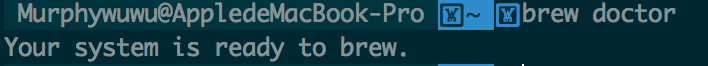
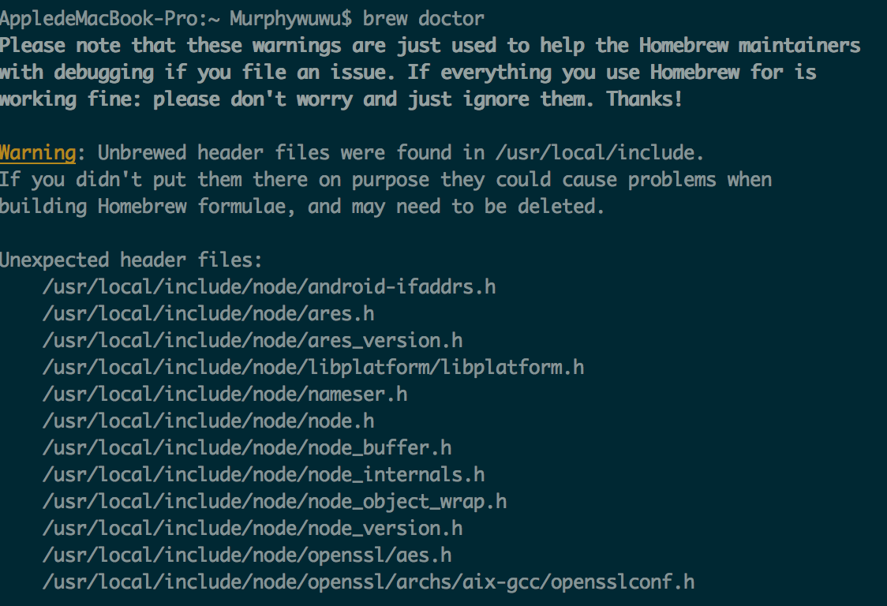
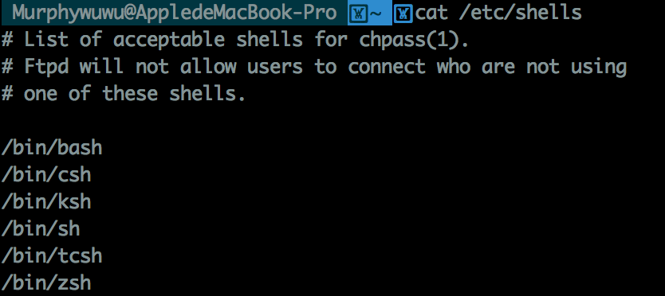

Homebrew 
--------------------------
Homebrew是包安装工具可以让你安装和更新程序变得更方便，而os x系统默认的包管理工具是**Macports**,**Macports**的工作方式和Homebrew类似，都是下载源码然后在本地编译，它安装时依靠本地(确切的说是/opt/local这个文件内)所存在的包进行编译安装，至于系统内存不存在相同的东西，它不关注，这也导致了一个问题，会给系统产生过多的冗余文件。Homebrew的出现解决了这一问题，只要系统已经有了包，那么homebrew就不会在安装了。而且homebrew的管理也是很强大的，所有的包都安装在/user/local/下面并且使用Ruby定义软件包安装配置（叫做formula），定制非常简单。
在安装Homebrew之前，需要将 Xcode Command Line Tools 安装完成，这样你就可以使用基于 Xcode Command Line Tools 编译的 Homebrew。

###1. Xcode Command Line Tools安装
整个苹果系统的开发环境基础便是Xcode Command Line Tools，注意这个与Xcode的区别，Xcode Command Line Tools是开发环境的命令集，Xcode是苹果的IDE，安装其中之一并不意味这另一个也被安装。在终端执行下列命令安装Xcode Command Line Tools。

`xcode-select --install`

###2.Homebrew安装
在终端下执行以下命令
`ruby -e "$(curl -fsSL https://raw.githubusercontent.com/Homebrew/install/master/install)"`

通过下列命令将`/usr/local/bin`添加至`$PATH`环境变量中

`echo 'export PATH="/usr/local/bin:$PATH"' >> ~/.bash_profile`

安装完成后执行`brew doctor`，若显示如下则安装成功

在我第一次使用此命令时，出现如下**错误**

**原因及解决方案**
原因在于我没有用homebrew安装node,导致了homebrew的抱怨,要解决这个问题依次输入以下命令后用homebrew安装node便可以解决
`sudo npm uninstall npm -g`

`sudo rm -rf /usr/local/lib/node /usr/local/lib/node_modules /var/db/receipts/org.nodejs.*`

`sudo rm -rf /usr/local/include/node /Users/$USER/.npm`

`sudo rm /usr/local/bin/node`

`sudo rm /usr/local/share/man/man1/node.1`

`sudo rm /usr/local/lib/dtrace/node.d`

安装完成后，Homwbrew 会将本地 /usr/local 初始化为 git 的工作树，并将目录所有者变更为当前所操作的用户，将来brew的相关操作不需要sudo 
###3.Homebrew常用命令
+ `brew install [package]`:安装包
+ `brew uninstall [package]`:卸载包
+ `brew outdated`:列出过时的软件
+ `brew upgrade`:更新过时的软件(全部或指定)
+ `brew update`:升级homebrew在服务器端上的包目录
+ `brew list`:列出所有安装的包
+ `brew clean up`:清理旧版本缓存
+ `brew info`:安装包信息检索

>*brew update is for updating Homebrew, brew upgrade is for updating installed software*

###4.利用Homebrew安装常用包
+ `brew install node`

+ `brew install python3`

+ `brew install wget` 

你也可以输入`brew search`来寻找需要安装的包，或者在这里查找[searchbrew](http://searchbrew.com/)
###5.Homebrew Cask 
Homebrew Cask可以优雅、简单、快速的安装和管理 OS X 图形界面程序，比如 Google Chrome 和 Dropbox。运行以下命令进行安装

`brew tap caskroom/cask  // 添加 Github 上的 caskroom/cask 库`

`brew install brew-cask  // 安装 brew-cask`

####推荐安装程序
`brew cask install alfred`

`brew cask install appcleaner`

`brew cask install cheatsheet`:显示当前程序的快捷键列表，默认快捷键是长按command键。

同样的你也可以通过输入`brew cask search`来寻找需要安装的app，或者在这里查找[caskroom](http://caskroom.io/search)

iTerm2
--------------------
iTerm2是MAC OS下一个牛逼的终端。
###安装
`brew cask install iterm2`

###常用快捷键
+ `command+shif+h`:弹出历史记录窗口
+ `command+/`:高亮当前鼠标位置
+ `command+;`:自动补全命令
+ `command+f`:全文查找功能，输入要查找的内容,即可在当前命令行页面查找并高亮显示
+ `command+shif+s`:保存当前窗口快照 
+ `command+opt+b`:快照回放

###设置
[iter2配置](https://laoshuterry.gitbooks.io/mac_os_setup_guide/content/4_ZshConfig.html)
[打造好用的终端](http://imwuyu.me/talk-about/cool-iterm2.html/)

zsh和oh-my-zsh
---------------------------
zsh也是shell的一种，通过输入下面的命令可以查看你的系统中提供了几种shell

`cat /etc/shells` 

显示如下

可见系统中提供了6中shell，OS X默认的shell是bash

**使用zsh的理由**
[使用zsh的9个理由](http://lostjs.com/2012/09/27/zsh/)
**将zsh设为默认的shell**

输入`chsh -s /bin/zsh`命令，然后重启iTerm2，zsh就已经被配置成默认shell了

###oh-my-zsh
####安装oh-my-zsh
oh-my-zsh的发布页面[oh-my-zsh](https://github.com/robbyrussell/oh-my-zsh)，安装配置方式都在这上面。我是通过`wget`进行的安装
 `wget --no-check-certificate http://install.ohmyz.sh -O - | sh`
####zsh配置
1 **主题配置**
zsh的配置几乎都在~/.zshrc下面，用编辑器打开文件，你会看到很多选项，建议你感觉自己的需求进行配置，不懂得可以查询文档。这里我只说一下主题的配置。在~/.oh-my-zsh/themes存在各式各样的主题文件，每个主题的样子你可以通过这个[网址](https://github.com/robbyrussell/oh-my-zsh/wiki/Themes)进行查看，选好样式后，在.zshrc中的ZSH_THEME设置成你所选用的主题。重启iTerm2，便可以看到相应的效果。这里要注意不要使用Mac默认编辑器打开.zshrc进行编辑，最好使用你自己平常使用的编辑器如sublime text,不然容易出现错误，因为Mac自带的编辑器在保存时引号会自动识别成中文式的，输入以下命令便可通过Sublime text打开配置文件。

`open ~/.zshrc -a /Applications/Sublime\ Text.app`

2 **插件配置及使用**
[官方插件列表](https://github.com/robbyrussell/oh-my-zsh/wiki/Plugins)

[终极shell](http://macshuo.com/?p=676)
[哦！我的zsh!](http://hczhcz.github.io/2014/03/27/oh-my-zsh.html)
[Zsh使用指南](http://hackerxu.com/2014/11/19/ZSH.html)
[那些我希望在一开始使用 Zsh(oh-my-zsh) 时就知道的](http://segmentfault.com/a/1190000002658335)
[关于oh-my-zsh插件的使用](http://www.cnblogs.com/memory4young/p/about-oh-my-zsh-plugin-sublime.html)

