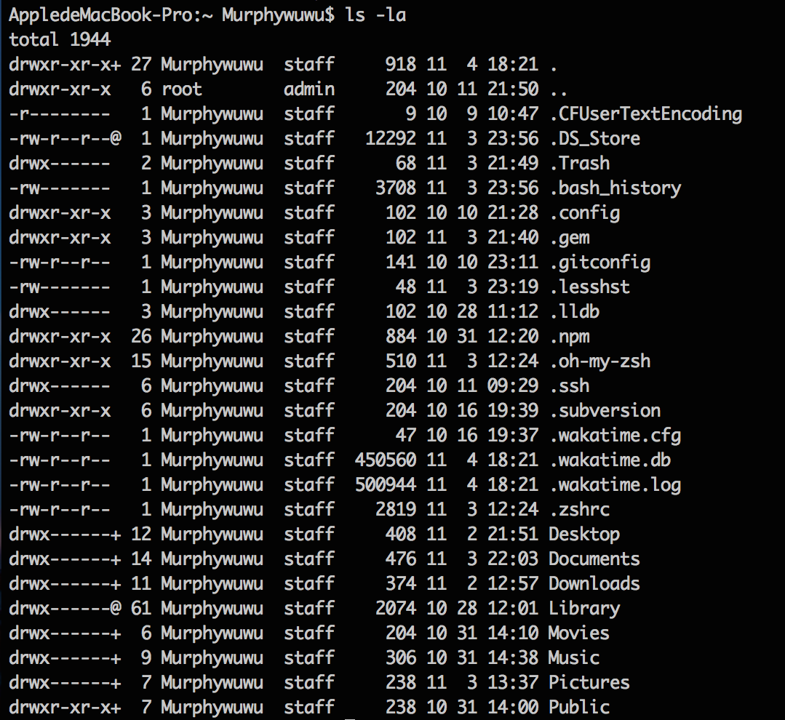

MAC终端命令行
====================
使用命令行能够做这些事情
--------------------
+ Finder会隐藏许多你不太需要的文件，然而commad line会允许你访问所有文件
+ 许多功能在图形界面不提供，只有通过命令行来实现
+ 通过command line可以远程访问你的Mac
+ `administrators`用户可以通过`sudo`命令获得root用户权限

了解命令行
------------------
+ `用户名$`:代表命令执行结束
+ 命令行组成:`Command Name+Options+Arguments+Extras`(最后三部分可选),Options部分用`-`作为前导符,Arguments部分用来细化命令或指定这个命令具体实施对象,Extras部分则用来进一步实现其他功能
+ 如果你输入了错误的命令，系统会返回一些错误信息。但是系统并不会阻止你做傻事

命令行使用指南
-------------------
大多数命令都包含一个使用指南，会告诉你任何你需要的关于这个命令的所有细节,在命令行中输入`man command-name`即可获取，例如输入`man ls`即可获取`ls`命令的使用指南,你可以
1. 输入`/`和关键字搜索
2. 按`Q`退出使用指南
当然如果你并不知道`command-name`,可输入`man -k`+关键字,对整个指南数据库进行搜索
###关于文件路径
####绝对路径和相对路径
+ 绝对路径:完整描述一个文件的位置，总是以斜杠`/`开头,`~`代表当前的home folder
+ 相对路径:只描述一部分位置，和你在command line的下的当前目录有关。`..`代表父目录

####关于文件路径

#####手动输入
+ `pwd`:显示当前文件的绝对路径
+ `ls`:列出当前目录下的所有文件
+ `cd`:切换目录
如果目录中包含特殊字符如空格,如`cd ~\Drop Box`便会发生错误，因为直接输入空格会造成系统识别困难，必须使用特殊的语法来表示这些字符。要解决这个问题，可在空格前加`\`反斜杠,`cd ~\Drop/ Box`或者加引号`"cd ~\Drop Box"`

#####自动生成
将文件从Finder拖到Terminal窗口可直接生成绝对路径

####查看隐藏文件
`ls`命令会隐藏文件名以 `.`开头的文件，但是这些文件却可以被显示出来，方法是利用`-a`选项。例如：
1. `ls -la`:查看以`.`开头的隐藏目录
2. `ls -lA`:查看以`.`开头的隐藏目录,但是不显示当前目录`.`和父目录`..`

 添加的`-l`选项，目的是控制输出格式。在输出的内容中包括`.`和`..`两项，分别代表当前文件夹和父文件夹，若不想显示这两项，将`-a`换成`-A`即可。

###关于管理文件
####打开文件
+ `open+文件路径`:打开文件或程序,`-a`选项要求自行选择打开的程序, `-e`选项强制在TextEdit中编辑此文件,输入`open .`可打开当前目录
例子:`open -a appName fileName`
####读取文件
+ `cat+file`:会按顺序读取文件内容并输出到 Terminal 窗口
+ `less+file`:同样的会按顺序读取文件,但按`v`键也可编辑文件
+ `which+命令`:告诉你执行某个命令时，这个命令在使用哪一个文件或者说这个命令位于那个文件之内
+ `file+file`:根据文件内容输出文件类型
####删除文件
+ `rm file`:删除文件file，系统会先询问是否删除
+ `rm -f file`:强行删除file，系统不再提示
+ `rm -rf dir`:强行删除目录dir下的所有文件、子目录下的所有文件和目录、删除dir本身

###关于管理系统
####切换用户
`su`命令代表“substitute user identity”，允许你在命令行中轻松切换到另一个用户账户。
1. `su`+用户名:切换账户，然后会要求你输入密码(但是输入的时候不会显示)。
2. `who -m`:显示当前用户
###其他命令
 + `control + C`:终止错误命令
 + `history`:查看历史记录
 + `control + L`:清屏
