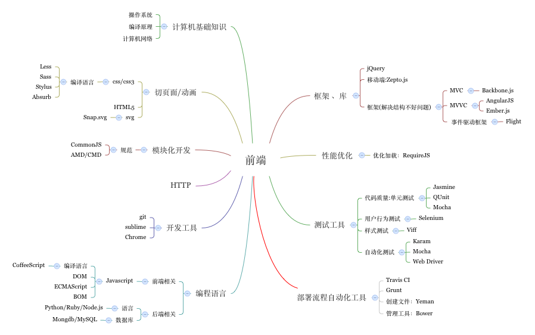

前端学习
=================
>###学而不思则罔,思而不学则殆

[同步博客地址](http://segmentfault.com/u/murphywuwu)

前端知识导图
-----------------

博客目录
-----------------
[JavaScript](https://github.com/murphywuwu/Blog/JS)

[CSS/CSS3](https://github.com/murphywuwu/Blog/CSS)

[Productivity Tool]( https://github.com/murphywuwu/Blog/tree/master/Productivity%20Tool)

[HTML5](https://github.com/murphywuwu/Blog/HTML5)

[HTTP](https://github.com/murphywuwu/Blog/HTTP)

[Front-End Framework](https://github.com/murphywuwu/Blog/tree/master/Front-End%20Framework)

[GO](https://github.com/murphywuwu/Blog/GO)

[Python](https://github.com/murphywuwu/Blog/Python)

[NODEJS](https://github.com/murphywuwu/Blog/NODEJS)

实践实践再实践
------------------
####1.IFE-TASK-0001
DEMO:[IFE-TASK-0001]()
**参考**:[task0001](https://github.com/baidu-ife/ife/tree/master/2015_spring/task/task0001)
####2.童年照分享页面制作
DEMO:[Child-Photo-Display]()
**参考**:[Book Preview](https://github.com/codrops/BookPreview)

